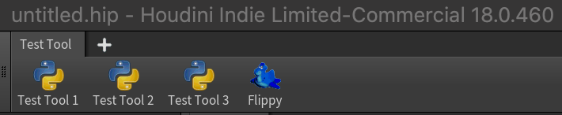
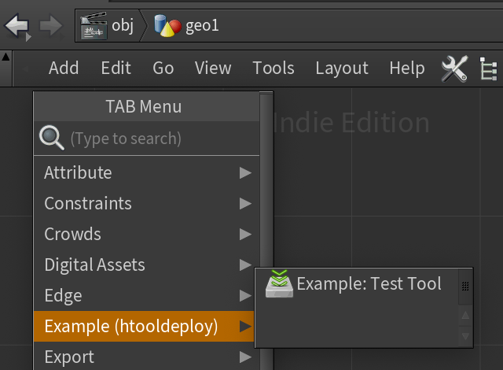

Tutorial
========

.. toctree::
   :numbered:

   getting_started
   tool_structure
   ../installing
   development_mode
   modifying_test_tool
   installing_tool
   conclusion

In the following tutorial, we will look at how to install a tool in
:ref:`Development Mode`, make a change, then install the tool for real to our
home folder.

.. _Test Tool:

Test Tool
^^^^^^^^^
Inside the ``examples`` folder you can find a folder called ``test_tool``.
This is a dummy tool consisting of a SOP level otl called
**Example: Test Tool** which depends on an external Python library. There is
also a shelf, :ref:`Test Tool` with a few tools that run scripts to pop up some
dialogs.

Once we finish the installation, we'll be able to find them here

All it does is:

.. image:: images/torus_spin.gif
   :alt: Wheeeeeeee

.. seealso::
   `Examples folder on GitHub <https://github.com/jamesrobinsonvfx/
   htooldeploy-test_tool>`_

