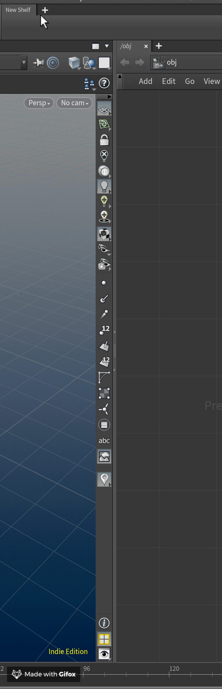
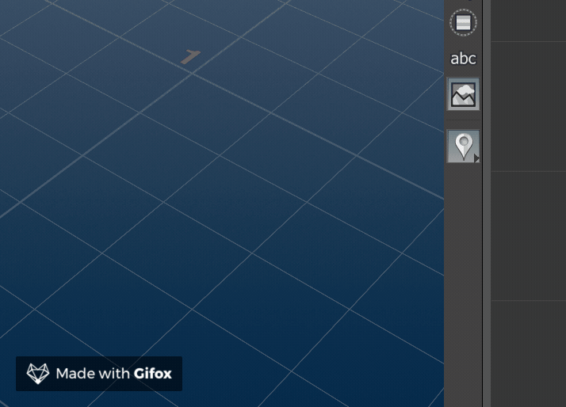
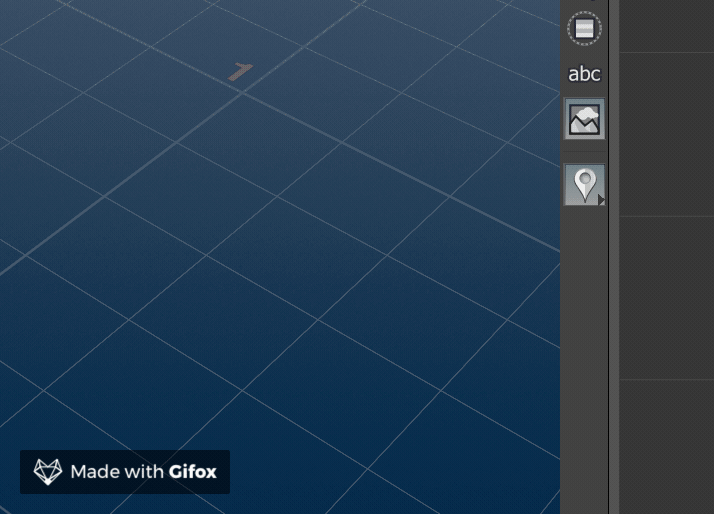

Modifying :ref:`Test Tool`
==========================

Since we installed :ref:`Test Tool` in :ref:`Development Mode`, let's take a
quick look at why that was useful.

Launch Houdini and check to see that that :ref:`Test Tool`'s shelf items are
there.

Try launching ``Test Tool 1`` from the shelf and see what happens.

Let's change the severity of this messagebox, and add a little more to the
message. The source code can be found in
``source/python2.7libs/test_tool/tools.py`` Open with any text editor::

    code ~/dev/htooldeploy-test_tool/source/python2.7libs/test_tool/tools.py

.. code-block:: python
   :linenos:
   :emphasize-lines: 8-10

    """Tools

    An external python module to help demonstrate the test_tool tutorial.
    """
    import hou

    def tool_1(message):
        """Shelf tool 1"""
        hou.ui.displayMessage(message)

    def tool_2(message):
        """Shelf tool 2"""
        hou.ui.displayConfirmation(message)

    def tool_3...

Let's change ``line 10`` to be a little more severe, and add something to the
end of the message.

.. code-block:: python
    :linenos:
    :lineno-start: 8

    def tool_1(message):
        """Shelf tool 1"""
        hou.ui.displayMessage(
            "{0}\nIsn't that great?!".format(message),
            severity=hou.severityType.Warning
        )

Let's save and check the check the shelf again.

The box now shows up as a warning, with our added text. We can commit this
change to the source if we need to, without having to hunt down the installed
installed folders.

Now that we're happy with our tool, let's install it for real.