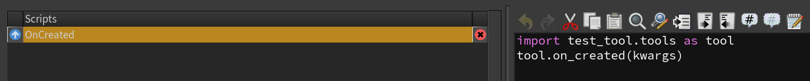
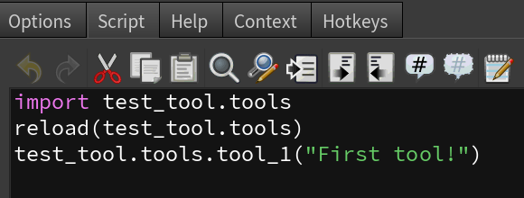

Test Tool Structure
===================
Inside the ``Examples`` directory, there is a test tool repo structure.
We will use it in this tutorial to explain tool structure and how to
install quickly using ``htooldeploy``.

The :ref:`Test Tool` hierarchy is as follows::

    test_tool/
        _version
        source/
            python2.7libs/
                test_tool/
                    __init__.py
                    tools.py
            otls/
                example_testtool.hdalc
            toolbar/
                test_tool.shelf

source/
^^^^^^^
The ``source/`` directory is the most important part of structuring the tool's
repository. Its directories should mimic the ones found in ``$HFS/houdini``.
A list of common folders currently recognized by ``htooldeploy`` can be found
at :ref:`Houdini Site Folders`.

.. seealso::
    `Configuring Houdini <https://www.sidefx.com/docs/houdini/basics/
    config.html>`_

_version
^^^^^^^^
``_version`` is an optional file. It's useful to have when working in
:ref:`Development Mode`, as it will automatically add the version string to the
Houdini Package JSON file. No harm if it's not there though. It should have a
the following (whitespace/tabbing is flexible, as long as it's close).

.. code-block:: python

    __version__ = "0.1.0"

.. note::
    This string can actually be in any file in the root directory.
    ``htooldeploy`` will scan all root level files for this string and use the
    first one it finds. See :meth:`~htooldeploy.htool.HTool.tool_version`

Tools
^^^^^

If we look at the **Type Properties** of the :ref:`Test Tool` hda, we can see that
it depends on some external Python library for its Event Handler scripts.

Same goes for the shelf tools

